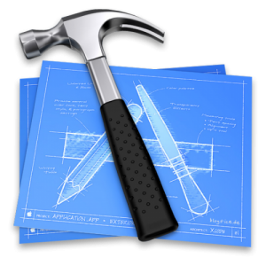
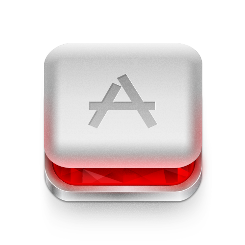

!SLIDE title

# Ruby
as a second language

!SLIDE center


.notes This is in fact an ios dev camp. A camp dedicated to the beautiful programming language Objective-C. It is a language that I grew to understand and I would admit through an act of Stockholm Syndrome have come to love the language in its own quirky way.

!SLIDE title


## Quad Curve Menu
https://github.com/burtlo/QuadCurveMenu

.notes More specifically I love the effect of what you can accomplish with Objective-C. Creating and building iOS applications beautiful and admittedly they do make it possible to do some very sexy things with animations and core functionality. However, there are one thing I will never love about working with iOS project.

!SLIDE title


.notes The first is all the clicking involved in the development. Particularlly, again this is related to manipulating the project file to add new files, manage targets, etc. So many tutorials describe clicking here and dragging. Opening specifically menus and finding specific tabs that need to be manipulated.

!SLIDE title



.notes And the second is specifically Xcode or more specifically working with Xcode project files. Generally this is the reason for the most amounts of clicking. The xcode editor is in some cases a necessary evil to do work with the verbose and tedious to type frameworks.

XCode Project Files are **Nightmares**

!SLIDE


.notes So lets talk about how ruby solves these problems of this clicking.

!SLIDE title


## Cocoapods

```ruby
platform :ios, '6.0'
pod 'JSONKit',       '~> 1.4'
pod 'Reachability',  '~> 3.0.0'
```

.notes First, and probably the most prominent, is Cocoapods. Which is a dependency manager that allows you to define and retrieve all the libraries you need to make your great applications. This application is written exclusively in ruby. https://github.com/CocoaPods/CocoaPods

!SLIDE title

# xcoder

https://github.com/rayh/xcoder

```
$ gem install xcoder
```

.notes This is a second tool that allows you to build, ship and test your application from the command-line. With support to deploy to ftp, ssh, s3 and testflight.

!SLIDE commandline

# Command-Line Builds

```ruby
# Rakefile

require 'xcoder/rake_task'

Xcode::RakeTask.new
```

```
$ rake -T
rake xcode:babygram:babygram:debug:build            # Build Babygram Babygram Debug
rake xcode:babygram:babygram:debug:clean            # Clean Babygram Babygram Debug
rake xcode:babygram:babygram:debug:package          # Package Babygram Babygram Debug
rake xcode:babygram:babygram:debug:test             # Test Babygram Babygram Debug
rake xcode:babygram:babygram:release:build          # Build Babygram Babygram Release
rake xcode:babygram:babygram:release:clean          # Clean Babygram Babygram Release
...
```

.notes Similar to the functionality to what you expect from `xctool` for building, testing and delivering your project. https://github.com/facebook/xctool

!SLIDE title


(ssh and ftp)

!SLIDE title

# Project File Manipulation

```ruby
FileUtils.cp_r "examples/Reachability/Vendor", "spec/TestProject"

source_files = [ 'Vendor/Reachability/Reachability.m' , 'Vendor/Reachability/Reachability.h' ]

project.group('Vendor/Reachability') do
  source_files.each { |source| create_file source }
end
```

.notes There are also features that allow you to dynamically modify your xcode project file. Perhaps you are using continuous integration to build your product and deliver to your beta customers and you want to insert or replace files necessary for the production application. Similar to `Xcodeproj`, xcoder allows you to manipulate an xcode project file.


!SLIDE title

# Ex: Universal Framework

https://github.com/jverkoey/iOS-Framework

vs

https://gist.github.com/burtlo/7493202

## 14 manual steps vs ~56 lines of code

!SLIDE title


## exercism.io

.notes The most recent example of how I used xcoder was for the website exercism.io. Exercism is website that originally intended to teach you how to be a better (ruby) developer. It has since expanded to include JavaScript, Elixir, Clojure...

!SLIDE title


https://github.com/exercism/exercism.io/issues/316

.notes We wanted to add Objective-C but we wanted to make it easy for people to get started with
objective-c. We wanted to focus on the language and not as much time configuring
Xcode.

!SLIDE

# Complex

```
Creating the project in Xcode:

* Start Xcode create a new project.
* Select OSX-->Application and then Command Line Tool.
* Click Next and give it a project name using the ExerciseName is advised.
* Select Foundation at the bottom from the drop down menu.
* Click Next until the wizard is finished.
* Now that the project is created click on Editor-->Add Target.
* Select OSX-->Other and select Cocoa Unit Testing Bundle.
* Ensure it's of type XCTest and that the project and target match then click finish.
* Open the new file which will be named ExerciseName_Tests.m in a folder called ExerciseName Tests * and replace the contents with the test file you got from exercism.
* Create a new file with the correct name for the exercise.
* Click on your project in the left hand pane.
* Select Build Phases on the right.
* Ensure that XCTest.framework exists under Link Binary With Libraries.
* Add your .m files to the compile sources list.
* Then use CMD-U to run the tests when you're ready.
```

!SLIDE commandline

# Simple

```
$ objc Bob
Looking for all files with prefix: Bob
Loading files into ExercismTestFixture (Project) at /var/folders/yl/ghj0mlzx2wd7gr9mth9v0kmr0000gn/T/ExercismTestFixture/ExercismTestFixture.xcodeproj

[Info] Loading settings for scheme 'IgnoreThisTarget' ... (854 ms)

=== TEST ===

  xcodebuild build build
    ExercismTestFixture / test-suite (Debug)
      ✓ Check dependencies (37 ms)
      ✓ Process test-suite-Info.plist (0 ms)
      ✗ Compile Bob.m (11 ms)
━━━━━━━━━━━━━━━━━━━━━━━━━━━━━━━━━━━━━━━━━━━━━━━━━━━━━━━━━━━━━━━━━━━━━━━━━━━━━━━━━━━━━━━━━━━━━━━
CompileC /Users/burtlo/Library/Developer/Xcode/DerivedData/ExercismTestFixture-denfxmkllhhbnfhfpafwbuihmrfk/Build/Intermediates/ExercismTestFixture.build/Debug/test-suite.build/Objects-normal/x86_64/Bob.o /Users/burtlo/jumpstartlab/warmups/bob/Bob.m normal x86_64 objective-c com.apple.compilers.llvm.clang.1_0.compiler
    cd /var/folders/yl/ghj0mlzx2wd7gr9mth9v0kmr0000gn/T/ExercismTestFixture
    setenv LANG en_US.US-ASCII
```

!SLIDE title

# objc

https://github.com/burtlo/objc

```
$ gem install objc
```

.notes Creating `objc` a tool which automatically creates a test project from a source file name. Which we use in **exercism.io** to provide a tool which makes it easier to get into building test driven Objective-C applications

.notes Objc packages a nearly complete project file that simply inserts your source and header files into the project when you run the command. Turning that entire long list of instructions for everyone of the test into a simple command:


!SLIDE



## http://www.rubymotion.com

.notes An added bonus of ruby is that eventually could take advantage of some of the
awesome advances that are taking place towards efficiency in RubyMotion. http://clayallsopp.com/posts/the-ruby-motion-way/ and https://gist.github.com/burtlo/5719253

!SLIDE title

# Cocoapods

# Xcoder

.notes Again I am strong proponent to using Objective-C when building iOS applications.
But when I look for tooling and ways to make my life easier I look at Ruby to
provide me with amazing tools that chnage

!SLIDE title


## Objective-C

.notes When I am building the next greatest game or the social experience that brings us
together I choose to use objective-C and iOS.

!SLIDE


## @franklinwebber

.notes The language that helps me make that job easier is Ruby.